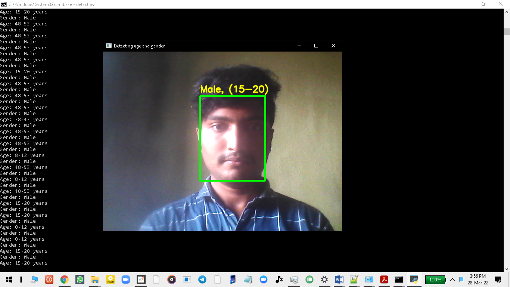
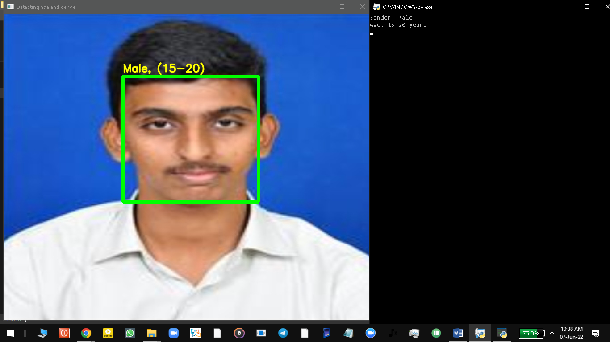
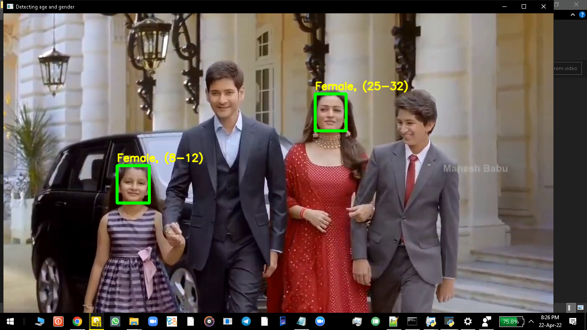

Gender Detection And Age Prediction Using OpenCV And Caffe

“Gender Detection And Age Prediction Using OpenCV And Caffe” is a python project which uses OpenCV library for camera input and Caffe deep learning framework by facebook to detect gender and age using pre trained Caffe models of Tal Hassner and Gil Levi which are trained by using Adience Benchmark Dataset of Kaggle and it makes use of Convolution Neural Networks comprising of many different layers.

Our main intention is to easy the process of finding criminals by searching in the given age group and gender and it also can be used to decide on how to communicate based on the gender.

SCREENSHOTS:

Input from camera

Input from image

Input from video

Registered

Login page

Invalid user

Granted Access

Apache Tomcat webserver

Oracle 10g database

Engineering books

Aptitude Tb

Engineering Calculator

Compilers

